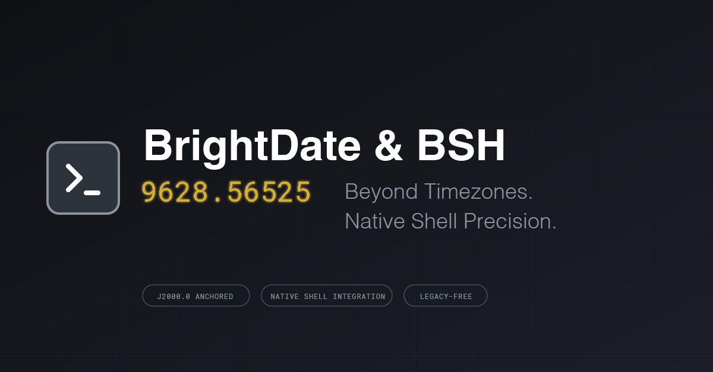

# BSH SDI Agent



A macOS menu bar application that acts as the **Secure Semantic Data Injection (SDI)** desktop agent for [BSH (BrightShell)](https://github.com/Digital-Defiance/bsh). It receives encrypted credential payloads from the `bsh-inject` shell builtin over a local Unix domain socket, decrypts them, and makes them available for actions such as clipboard injection, auto-fill, or forwarding to the system keychain — without the plaintext ever appearing in `ps`, the shell environment, or command history.

> SDI and the OSC 7777 protocol are original BSH inventions — there is no upstream zsh equivalent.

## How it works

The agent implements a four-step cryptographic protocol defined in the [BSH SDI RFC](https://github.com/Digital-Defiance/bsh/blob/main/docs/rfc-sdi-osc7777.md):

### Step 1 — X25519 handshake at login

When a BSH shell starts, it connects to the agent's randomized Unix domain socket (`$SDI_SOCKET_PATH` / `~/.config/sdi/socket`) and sends a 48-byte binary packet:

```
Bytes  0–15: session_id   (16 cryptographically random bytes)
Bytes 16–47: shell_pub    (ephemeral X25519 public key, 32 bytes raw)
```

The agent responds with its own 32-byte ephemeral X25519 public key. Both sides then derive a 32-byte session key via **HKDF-SHA256** (IKM = X25519 shared secret, salt = `session_id`, info = `"sdi-session-key"`). The key is never written to disk and sessions expire after 8 hours.

### Step 2 — Encrypt in the shell

`bsh-inject` reads stdin and encrypts it with **AES-256-GCM**. The payload `type`, `context`, and a monotonic sequence **counter** are passed as length-prefixed GCM Additional Authenticated Data (AAD), binding them into the auth tag so that tampering with metadata or replaying a captured sequence invalidates the ciphertext.

### Step 3 — Deliver over the terminal

The ciphertext is emitted as an **OSC 7777** escape sequence written directly to `/dev/tty` — invisible in the terminal output, invisible to `ps`, absent from shell history:

```
ESC ] 7777 ; <session_id_hex> ; <b64counter> ; <type> ; <b64context> ; <b64nonce> ; <b64ciphertext> ; <b64authtag> BEL
```

The shell delivers this to the agent using the binary `OSC_DELIVER` opcode (`0x02`) over the same persistent Unix socket connection established during the handshake. If the agent is unavailable, `bsh-inject` fails closed rather than falling back to plaintext.

### Step 4 — Agent decrypts and acts

The agent parses the OSC 7777 sequence, looks up the session key by `session_id`, verifies the **GCM auth tag** (which covers counter + type + context), enforces the **monotonic counter** to reject replays, decrypts the payload, and stores it in the ephemeral in-memory store with its TTL. Decrypted state is purged automatically after the TTL expires.

## Architecture

| File | Responsibility |
|---|---|
| `SDIAgentApp.swift` | SwiftUI app entry point; no windows — pure menu bar agent |
| `AppDelegate.swift` | Wires together `EphemeralStore`, `MenuBarController`, and `IPCServer` |
| `IPCServer.swift` | Unix domain socket server; binary ECDH handshake, binary OSC deliver loop, JSON relay fallback, session lifecycle |
| `CryptoEngine.swift` | AES-256-GCM decryption via Apple CryptoKit |
| `OSC7777Parser.swift` | Scans byte streams for OSC 7777 sequences and parses the 7-field body |
| `EphemeralStore.swift` | Thread-safe in-memory credential store with TTL sweeping (10-second tick) |
| `MenuBarController.swift` | `NSStatusItem` showing a lock icon; menu lists active credentials with TTL countdowns and copy-to-clipboard actions |
| `SDIPayload.swift` | `Codable` types for the decrypted JSON envelope (`ephemeral-auth`, `db-connection`) |

## Security properties

- **Randomized socket path** — generated fresh on each launch (`/tmp/sdi-agent-<16 hex chars>`); prevents socket squatting. The agent aborts if the path already exists.
- **chmod 600** — socket is owner-read/write only.
- **App Sandbox** enabled; socket path is advertised to child shells via `launchctl setenv` (non-sandboxed) and via `~/.config/sdi/socket` (sandbox-safe fallback, covered by a `home-relative-path` entitlement).
- **Forward secrecy** — each shell session uses a fresh ephemeral X25519 keypair; the derived key is never persisted.
- **Replay protection** — per-session monotonic counter tracked in memory; out-of-order or replayed OSC packets are rejected.
- **Rate limiting** — sessions are locked out after 10 decryption failures within 60 seconds.
- **Session expiry** — sessions expire after 8 hours regardless of activity.
- **Fail-closed** — `bsh-inject` does not fall back to plaintext if the agent is unavailable.
- **Memory hygiene** — session keys are revoked on shell disconnect; credentials are retained until their TTL to allow short-lived `bsh -c` invocations to be read by the consuming application.

## Supported payload types

### `ephemeral-auth`

```json
{
  "type": "ephemeral-auth",
  "context": "https://app.example.com",
  "ttl": 300,
  "data": {
    "username": "alice",
    "password": "s3cr3t",
    "email": "alice@example.com"
  }
}
```

### `db-connection`

```json
{
  "type": "db-connection",
  "context": "postgres://localhost/mydb",
  "ttl": 600,
  "data": {
    "engine": "postgres",
    "host": "localhost",
    "port": 5432,
    "user": "alice",
    "pass": "s3cr3t"
  }
}
```

## Installation

You can install the notarized SDI Agent app using Homebrew:

```sh
brew tap digital-defiance/tap
brew install --cask bsh-sdiagent
```

This will download and install the latest signed and notarized release to your /Applications folder.

---

## Usage

Once the agent is running, load the `bsh/sdi` module and use `bsh-inject` to deliver credentials:

```zsh
zmodload bsh/sdi

printf '{"user":"alice","pass":"s3cr3t","ttl":300}' \
  | bsh-inject --type ephemeral-auth --context https://app.example.com
```

The OSC 7777 sequence is emitted to `/dev/tty`. The agent decrypts it, stores the credentials, and shows them in the menu bar with a TTL countdown. Click any entry to copy a field to the clipboard, or use "Clear All" to purge the store immediately.

## Requirements

- macOS 13 Ventura or later (uses `Curve25519.KeyAgreement` and `AES.GCM` from Apple CryptoKit)
- Xcode 15 or later
- BSH with the `bsh/sdi` module

## Building

Open `BSH SDIAgent.xcodeproj` in Xcode, select the **BSH SDIAgent** scheme, and build (`⌘B`) or run (`⌘R`).

The app has no external dependencies — all cryptography uses Apple's built-in **CryptoKit** framework.

## Related

- [BSH (BrightShell)](https://github.com/Digital-Defiance/bsh) — the shell that generates SDI payloads
- [RFC — Secure Semantic Data Injection via OSC 7777](https://github.com/Digital-Defiance/bsh/blob/main/docs/rfc-sdi-osc7777.md) — full protocol specification
- [Digital Defiance](https://github.com/Digital-Defiance)

## License

Same license as BSH — see [LICENSE](LICENSE).
